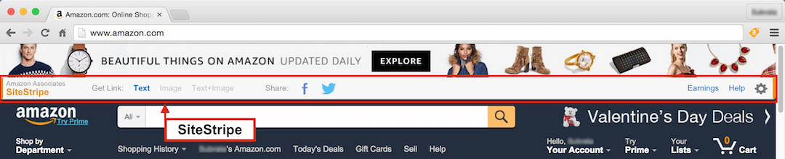

<link href="./docs/assets/css/markdown.css" rel="stylesheet"></link>

<!-- back to top -->
<a class="top-link hide" href="#top">↑</a>
<a name="top"></a>
<!-- end back to top -->

# Project 1: Fakee-Shop

*Fakee-Shop* is the leading website offering the best fake shopping experience online.


<!-- project repository shields -->
<p align="center">
  
  
  
  
</p>

<p align="center">
  
  
  
  
  
</p>
<!-- end project repository shields -->

## Table of contents

- [Project 1: Fakee-Shop](#project-1-fakee-shop)
  - [Table of contents](#table-of-contents)
  - [Overview](#overview)
    - [Mininal Viable Product concept (MVP)](#mininal-viable-product-concept-mvp)
    - [Slogan](#slogan)
    - [Logos](#logos)
    - [Screenshots](#screenshots)
    - [Links](#links)
  - [Specifications](#specifications)
    - [Project requirements](#project-requirements)
    - [RESTful APIs](#restful-apis)
    - [UX/UI Design](#uxui-design)
    - [Built with](#built-with)
    - [What I learned](#what-i-learned)
    - [Continued development](#continued-development)
  - [Useful resources](#useful-resources)
  - [Authors](#authors)
  - [Acknowledgments](#acknowledgments)

**Note: Delete this note and update the table of contents based on what sections you keep.**

## Overview

*Fakee-Commerce* is the leading website offering the best fake shopping experience online.

### Mininal Viable Product concept (MVP)

*Fakee-Shop* is the leading website offering the best fake shopping experience online.

### Slogan

` the best fake shopping experience online`

### Logos

1. *Logo standard (jpeg)*


2. *Logo white transparent (png)*

<p style="background-color: black;">
  
</p>

3. *Logo black transparent (png)*

<p style="background-color: white;">
  
</p>

4. *Logo transparent (png)*

<p style="background-color: #c48538;">
  
</p>

### Screenshots

**Fakee-Shop SiteStripe and header navigation**


Add a screenshot of your solution. The easiest way to do this is to use Firefox to view your project, right-click the page and select "Take a Screenshot". You can choose either a full-height screenshot or a cropped one based on how long the page is. If it's very long, it might be best to crop it.

Alternatively, you can use a tool like [FireShot](https://getfireshot.com/) to take the screenshot. FireShot has a free option, so you don't need to purchase it.

Then crop/optimize/edit your image however you like, add it to your project, and update the file path in the image above.

**Note: Delete this note and the paragraphs above when you add your screenshot. If you prefer not to add a screenshot, feel free to remove this entire section.**

### Links

- Solution URL: [https://github.com/technoveltyco/bootcamp-project1](https://github.com/technoveltyco/bootcamp-project1)
- Live Site URL: [https://technoveltyco.github.io/bootcamp-project1/](https://technoveltyco.github.io/bootcamp-project1/)
- KANBAN Dashboard: [https://github.com/users/technoveltyco/projects/4](https://github.com/users/technoveltyco/projects/4)

## Specifications


### Project requirements

1. Must use at least two server-side APIs.
2. Must use a CSS framework other than Bootstrap.
3. Must use client-side storage to store persistent data.
4. Must have a polished UI.
5. Must meet good quality coding standards (indentation, scoping, naming, etc.).
6. Must NOT use alerts, confirms, or prompts (look into modals). 
7. Must be deployed to GitHub Pages.
8. Must be interactive (i.e: accept and respond to user input).
9. Create UX/UI with Figma.
10. Create a project Kanban dashboard with agile user stories.

### RESTful APIs 

The website will use Mock-Up APIs for the back-end:

- [Platzi Fake Store API](https://fakeapi.platzi.com/) : for creating the products, filtering and user accounts.
- [Faker API](https://fakerapi.it/en) : For general fake data like companies, credit cards, addresses, etc.
- [ExchangeRate API](https://www.exchangerate-api.com/docs/standard-requests) : for currency exchange.

### UX/UI Design

The UX/UI design will follow the specifications of the [High-converting e-commerce UI kit](https://www.figma.com/community/file/1192047659163071392) which defines a retail e-commerce website. The full theme is freely available in the Figma Community. 

Here there are the links to the Figma resources that are being considered in the implementation of the Fakee-Shop:

- Full theme Figma copy: [The High-converting e-commerce UI kit](https://www.figma.com/file/FnvubxQA5jPzUX9Do2tr1a/High-converting-e-commerce-UI-kit-(Community)?node-id=1410%3A5648&t=IS3Y0sgcVNyf7aZK-1)
  - [Homepage & category page](https://www.figma.com/file/FnvubxQA5jPzUX9Do2tr1a/High-converting-e-commerce-UI-kit-(Community)?node-id=2502%3A4038&t=IS3Y0sgcVNyf7aZK-1)
  - [Product list page](https://www.figma.com/file/FnvubxQA5jPzUX9Do2tr1a/High-converting-e-commerce-UI-kit-(Community)?node-id=2587%3A6638&t=IS3Y0sgcVNyf7aZK-1)
  - [Product details page](https://www.figma.com/file/FnvubxQA5jPzUX9Do2tr1a/High-converting-e-commerce-UI-kit-(Community)?node-id=2628%3A18776&t=IS3Y0sgcVNyf7aZK-1)
  - [Product card](https://www.figma.com/file/FnvubxQA5jPzUX9Do2tr1a/High-converting-e-commerce-UI-kit-(Community)?node-id=2543%3A4678&t=IS3Y0sgcVNyf7aZK-1)
  - [Search](https://www.figma.com/file/FnvubxQA5jPzUX9Do2tr1a/High-converting-e-commerce-UI-kit-(Community)?node-id=2502%3A4043&t=IS3Y0sgcVNyf7aZK-1)
  - [Navigation](https://www.figma.com/file/FnvubxQA5jPzUX9Do2tr1a/High-converting-e-commerce-UI-kit-(Community)?node-id=2502%3A4044&t=IS3Y0sgcVNyf7aZK-1)
  - [DESIGN SYSTEM](https://www.figma.com/file/FnvubxQA5jPzUX9Do2tr1a/High-converting-e-commerce-UI-kit-(Community)?node-id=1410%3A5648&t=IS3Y0sgcVNyf7aZK-1)


### Built with

- [Semantic HTML5 markup](https://developer.mozilla.org/en-US/docs/Web/HTML)
- [CSS custom properties](https://developer.mozilla.org/en-US/docs/Web/CSS)
- [Flexbox](https://developer.mozilla.org/en-US/docs/Glossary/Flexbox)
- [CSS Grid](https://developer.mozilla.org/en-US/docs/Web/CSS/CSS_Grid_Layout)
- [Mobile-first workflow](https://developer.mozilla.org/en-US/docs/Learn/CSS/CSS_layout/Responsive_Design)
- [Figma](https://www.figma.com/)
- [Adobe Express](https://express.adobe.com/)
- [Tailwind CSS](https://tailwindcss.com/)
- [Tailwind Elements](https://tailwind-elements.com/quick-start/)
- [MDBootstrap](https://mdbootstrap.com/docs/standard/)
- [Font Awesome 6](https://fontawesome.com/v6/docs)
- [Google Fonts](https://fonts.google.com/)
- [Vanilla JavaScript](https://developer.mozilla.org/en-US/docs/Web/javascript)
- [Web APIs](https://developer.mozilla.org/en-US/docs/Web/API)
- [Node.js](https://nodejs.org/en/)
- [Prettier](https://prettier.io/)

### What I learned

Use this section to recap over some of your major learnings while working through this project. Writing these out and providing code samples of areas you want to highlight is a great way to reinforce your own knowledge.

To see how you can add code snippets, see below:

```html
<h1>Some HTML code I'm proud of</h1>
```

```css
.proud-of-this-css {
  color: papayawhip;
}
```

```js
const proudOfThisFunc = () => {
  console.log("🎉");
};
```

If you want more help with writing markdown, we'd recommend checking out [The Markdown Guide](https://www.markdownguide.org/) to learn more.

**Note: Delete this note and the content within this section and replace with your own learnings.**

### Continued development

Use this section to outline areas that you want to continue focusing on in future projects. These could be concepts you're still not completely comfortable with or techniques you found useful that you want to refine and perfect.

**Note: Delete this note and the content within this section and replace with your own plans for continued development.**

## Useful resources

- Software/Web Standards
  - [UML 2](https://www.uml.org/what-is-uml.htm)
  - [Drawing UML with PlantUML](https://plantuml.com/guide)
  - [PlantUML - Live editor ](https://plantuml.com/)
- Agile/Scrum
  - [User stories with examples and a template](https://www.atlassian.com/agile/project-management/user-stories)
  - [How to Write Acceptance Criteria: Examples and Best Practices](https://www.mobindustry.net/blog/how-to-write-acceptance-criteria-examples-and-best-practices/)
  - [What is the Definition of Done (DOD) in Agile?](https://www.agile-academy.com/en/scrum-master/what-is-the-definition-of-done-dod-in-agile/)
- Public HTTP APIs
  - [Public API Lists - GitHub](https://github.com/public-api-lists/public-api-lists) - Useful resource to choose free public APIs that can be used for Proof of Concept projects.
- UX/UI Web Design
  - [Figma - High-converting e-commerce UI kit](https://www.figma.com/community/file/1192047659163071392) - The free design from Figma Community which Fakee-Shop project is based on.
  - [Adobe Express - Logo Maker](https://express.adobe.com/express-apps/logo-maker/)
  - [20 Elements of Modern Web Design That You Need to Know](https://www.lambdatest.com/blog/20-elements-of-modern-web-design/)
  - [Parts Of A Website: A Cheat Sheet For Non-Techies](https://www.markbrinker.com/parts-of-a-website)
  - [CMS Web Design: A Guide to Dynamic Content Applications](https://www.toptal.com/designers/ui/cms-web-design)
- Fonts/Images
  - [Font Awesome 6 Icons](https://fontawesome.com/v6/icons) - Only the free icons were used in this project.
  - [Wikimedia Commons](https://commons.wikimedia.org/wiki/Main_Page) - Free open source catalog of images.
- Tailwind
  - [Tailwind CSS Docs](https://tailwindcss.com/docs/installation) - The main reference for Tailwind CSS Framework.
  - [Tailwind UI Docs](https://tailwindui.com/documentation) - A good resource to speed the development using pre-designed Talwind components and template, but unfortunately it is not free :( . 
  - [Tailwind Elements](https://tailwind-elements.com/) - Bootstrap components recreated with Tailwind CSS, but with better design and more functionalities.
  - [Tailwind recommended class order](https://tailwindcss.com/blog/automatic-class-sorting-with-prettier#how-classes-are-sorted)
  - [MD Bootstrap - Top quality
open-source UI Kits](https://mdbootstrap.com/) - A good quality of Bootstrap UI open source components and with tons of good examples.
- HTML
  - [The Content Template element](https://developer.mozilla.org/en-US/docs/Web/HTML/Element/template) - we never implemented it, but it is a good solution when you want to reuse HTML and you do not have a rendering template library.

- CSS
  - [How to create a beating heart with pure CSS for your valentine](https://www.freecodecamp.org/news/how-to-create-a-beating-heart-with-pure-css-for-your-valentine-2aeb05e2d36e/)
  - Flexbox
    - [Breaking to a new row with flexbox](https://tobiasahlin.com/blog/flexbox-break-to-new-row/)
  - CSS Reset
    - [The New CSS Reset](https://elad.medium.com/the-new-css-reset-53f41f13282e) - Talking about the reset CSS approaches.
    - [The New CSS Reset - GitHub](https://elad2412.github.io/the-new-css-reset/) - The most recent resets for the latest CSS implementations in modern browsers.
  - Dark Mode
    - [Create A Dark/Light Mode Switch with CSS Variables](https://dev.to/ananyaneogi/create-a-dark-light-mode-switch-with-css-variables-34l8) 
    - [How to get dark mode working with CSS](https://www.freecodecamp.org/news/how-to-get-dark-mode-working-with-css-740ad31e22e/)
    - [MDN - prefers-color-scheme](https://developer.mozilla.org/en-US/docs/Web/CSS/@media/prefers-color-scheme)
    - [How “invert brightness” can improve accessibility and help us use our devices](https://www.tpgi.com/how-invert-brightness-can-improve-accessibility-and-help-us-use-our-devices/)
    - [OS: High Contrast versus Inverted Colors](https://adrianroselli.com/2017/11/os-high-contrast-versus-inverted-colors.html)
  - Code Snippet Styling
    - [Styling Code In and Out of Blocks](https://css-tricks.com/styling-code-in-and-out-of-blocks/) - Good document explaining how to create code snippet block beatyfully.
- Vanilla JavaScript
  - [Setting Default Values with JavaScript’s Destructuring](https://wesbos.com/destructuring-default-values)
  - [JavaScript modules](https://developer.mozilla.org/en-US/docs/Web/JavaScript/Guide/Modules)
  - [Getting the Width and Height of an Element](https://www.javascripttutorial.net/javascript-dom/javascript-width-height/)
- Web image formats
  - [Image file type and format guide](https://developer.mozilla.org/en-US/docs/Web/Media/Formats/Image_types)
  - [The Best Image Format for the Web: JPEG, WEBP, HEIC, or AVIF?](https://www.freecodecamp.org/news/best-image-format-for-web-in-2019-jpeg-webp-heic-avif-41ba0c1b2789/)
  - [How to Use SVG Images in CSS and HTML – A Tutorial for Beginners](https://www.freecodecamp.org/news/use-svg-images-in-css-html/)
- Git/Github
  - [5.2 Distributed Git - Contributing to a Project](https://git-scm.com/book/en/v2/Distributed-Git-Contributing-to-a-Project)
  - [How to Write Better Git Commit Messages – A Step-By-Step Guide](https://www.freecodecamp.org/news/how-to-write-better-git-commit-messages/)
  - [Github - Introducing draft pull requests](https://github.blog/2019-02-14-introducing-draft-pull-requests/)
  - [GitHub Flavored Markdown Spec](https://github.github.com/gfm/)
- Markdown
  - [The Markdown Guide](https://www.markdownguide.org/)
  - [Mermaid - Diagramming and charting tool](https://mermaid.js.org/)
  - [Include diagrams in your Markdown files with Mermaid](https://github.blog/2022-02-14-include-diagrams-markdown-files-mermaid/)
  - [Mermaid - Live Editor](https://mermaid.live/)

- IDE/Dev tools
  - [Prettier - Code formatter](https://prettier.io/)
  - [Prettier VSCode plugin](https://marketplace.visualstudio.com/items?itemName=esbenp.prettier-vscode)
  - [Tailwind Prettier plugin](https://github.com/tailwindlabs/prettier-plugin-tailwindcss)
  - [Markdown Preview Github Styling](https://marketplace.visualstudio.com/items?itemName=bierner.markdown-preview-github-styles)

## Authors

**Group 7**

- Elias, Jozef
  - GitHub - [https://github.com/ElanekJ](https://github.com/ElanekJ)
- Tyler, Warren
  - GitHub - [https://github.com/WarrenTyler](https://github.com/WarrenTyler)
- Rodriguez, Daniel
  - GitHub - [https://github.com/technoveltyco](https://github.com/technoveltyco) 

## Acknowledgments

The teacher and TAs that help us with resources and support to my questions during the development of this project.

Special acknowledgements for the website of the following companies, which keep innovating and inspiring many web designers and maketing teams: 

- [Amazon SiteStripe](https://affiliate-program.amazon.com/resource-center/how-to-use-amazon-sitestripe) - Inpiration for defining the definition of the top toolbar on Fakee-Shop's header.



- [Selfridges](https://www.selfridges.com/GB/en/) - Valentine's hero banner inspiration.


- [Marks & Spencer](https://www.marksandspencer.com/) - HTML layout and classnames.
